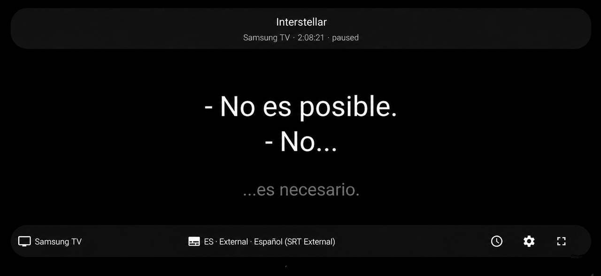

# SideSubs

**English** · [Español](README.es.md)

## Why SideSubs?

I built SideSubs for a simple reason: I usually watch movies and TV shows in their original language with English subtitles. Most of the time that works perfectly, but occasionally there is a line or expression I do not fully understand.

I wanted a way to keep the English subtitles on the TV while having Spanish — my native language — available on a phone or tablet as a second, synchronized subtitle track. That is what SideSubs does.

**SideSubs** is an Android-first second-screen subtitle companion for Plex and Jellyfin, built for bilingual subtitle viewing. It works with any supported subtitle language, not just English and Spanish.

It is designed for situations where you want to watch content from Plex or Jellyfin on a TV while reading a second subtitle language on a phone or tablet. The subtitle shown by SideSubs is independent from the subtitle selected in the media player, so both can be used at the same time.

The native Android app is the main SideSubs application. A Docker/Web client is also available as an experimental alternative.

## Screenshot



## Features

- Connects directly to Plex and Jellyfin.
- Uses the official Plex sign-in flow and Jellyfin Quick Connect.
- Discovers Plex Media Servers automatically and connects to Jellyfin servers by URL.
- Follows active Plex and Jellyfin playback sessions.
- Shows synchronized subtitles on a second screen.
- Keeps SideSubs subtitle selection independent from the Plex player subtitle.
- Supports external and embedded text subtitles.
- Supports automatic preferred-language selection and manual track selection.
- Supports regional language preferences such as Spanish (Spain) and Spanish (Latin America).
- Adjustable subtitle delay.
- Configurable subtitle size.
- Shows the current and next subtitle together.
- Cinema mode for fullscreen landscape viewing.
- Keeps playback polling and UI state aligned with the Android app lifecycle.
- Includes a local diagnostic log that avoids tokens, credentials and subtitle text.

## Android app

The Android application is standalone and does **not** require the Docker service.

On first launch, SideSubs lets you choose Plex or Jellyfin. Plex uses its account sign-in flow and automatic server discovery. Jellyfin connects to a server URL and authenticates through Quick Connect. Tokens are stored internally and do not need to be copied into the app manually.

Once connected, SideSubs detects active playback sessions, retrieves subtitle tracks from the selected media server and synchronizes the chosen subtitle with playback.

### Subtitle support

SideSubs can use text subtitle tracks exposed by Plex or Jellyfin, including:

- SRT / SubRip
- ASS / SSA
- WebVTT
- mov_text

Image-based subtitle formats such as PGS are not currently rendered as text.

For embedded text subtitles, SideSubs retrieves the subtitle through Plex, parses the complete cue timeline and keeps it locally for synchronized playback.

### Language selection

A preferred subtitle language can be configured in Settings.

Regional variants are supported where Plex metadata provides enough information, including examples such as:

- Spanish (Spain)
- Spanish (Latin America)
- English (United States)
- English (United Kingdom)
- Portuguese (Portugal)
- Portuguese (Brazil)

If Plex only identifies the base language, SideSubs falls back to that language.

### Cinema mode

Cinema mode is designed for landscape subtitle viewing.

The app enters fullscreen, keeps the screen awake and hides the status and control bars automatically. Touching the screen shows the controls temporarily.

If SideSubs is sent to the background and then reopened while Cinema mode is active, it restores the landscape/fullscreen state and briefly shows the controls before hiding them again.

## How it works

1. SideSubs connects to Plex or Jellyfin.
2. It detects active playback sessions.
3. It reads the current media item and available subtitle tracks.
4. It selects a subtitle using the preferred language or a manual track choice.
5. It retrieves and parses the subtitle timeline.
6. It follows the media-server playback position and renders the synchronized current and next subtitle.
7. Subtitle delay is applied locally without changing Plex playback.

If the selected Plex session disappears, SideSubs does not silently switch to another player.

## Architecture

The Android application uses a provider-neutral media interface:

```text
MediaProvider
    |
    +-- PlexClient          (implemented)
    +-- JellyfinClient      (implemented)
    +-- EmbyProvider        (future)
```

The UI works with generic playback and subtitle models, while Plex-specific identifiers remain inside the Plex provider.

Plex and Jellyfin are currently implemented.

## Docker / Web client — experimental

SideSubs also includes a Docker/Web client for browser-based use.

It runs independently from the Android application and can be useful on laptops, tablets, desktops or other devices where installing the Android app is not practical.

Feature parity with Android is not guaranteed.

### Docker image

Every push to `main` publishes:

```text
ghcr.io/soyxan/sidesubs:latest
```

Each build also receives a commit-specific tag:

```text
ghcr.io/soyxan/sidesubs:sha-abc1234
```

### Docker Compose / Portainer

The included `docker-compose.yml` uses the published GHCR image.

Required configuration:

```text
PLEX_TOKEN
```

Common configuration:

```text
MEDIA_PROVIDER=plex
PLEX_URL=http://host.docker.internal:32400
PLEX_CLIENT_FILTER=
PORT=8085
POLL_INTERVAL_MS=750
```

Example:

```yaml
services:
  sidesubs:
    image: ghcr.io/soyxan/sidesubs:latest
    container_name: sidesubs
    restart: unless-stopped

    ports:
      - "8085:8000"

    environment:
      MEDIA_PROVIDER: "plex"
      PLEX_URL: "http://host.docker.internal:32400"
      PLEX_TOKEN: "${PLEX_TOKEN}"
      POLL_INTERVAL_MS: "750"

    extra_hosts:
      - "host.docker.internal:host-gateway"
```

No media-library volume is required.

Open the web client at:

```text
http://YOUR-SERVER-IP:8085
```

Never commit your Plex token to GitHub.

## Security and privacy

### Android

- Plex and Jellyfin authorization is stored internally on the device.
- Tokens are never shown in the UI.
- Diagnostic logs do not contain tokens, credentials or subtitle text.
- SideSubs does not require filesystem access to the Plex media library.

### Docker/Web

The Docker/Web client is intended primarily for trusted home-LAN use.

- The Plex token remains server-side.
- The browser does not receive the Plex token.
- The web UI currently has no authentication layer.
- Do not expose it directly to the public Internet without an appropriate security layer.

## Development

Android:

- Kotlin
- Native Android UI
- Minimum SDK 26
- Target SDK 36

Docker/Web:

- Python 3.12
- FastAPI
- Uvicorn

## Versioning

SideSubs uses Git tags for official releases.

- Android release builds created from a version tag use the same semantic version as `versionName`.
- Pushes to `main` publish Docker `latest` and a commit-specific `sha-...` tag.
- Version tags such as `v0.9.1` publish the corresponding Docker image tag.

## License

SideSubs is released under the [MIT License](LICENSE).
